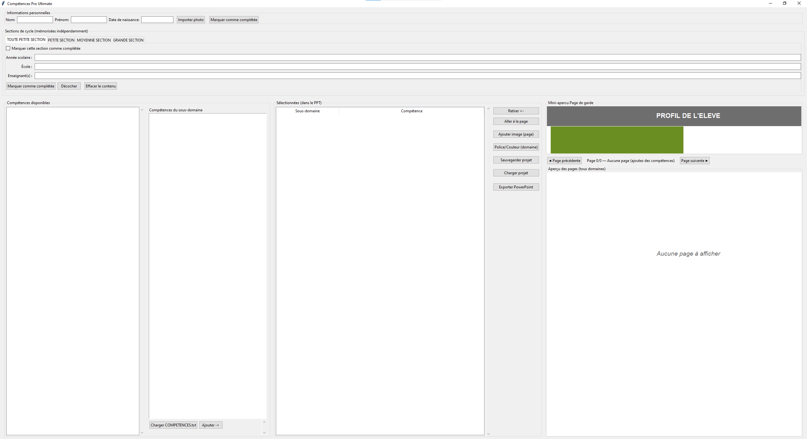
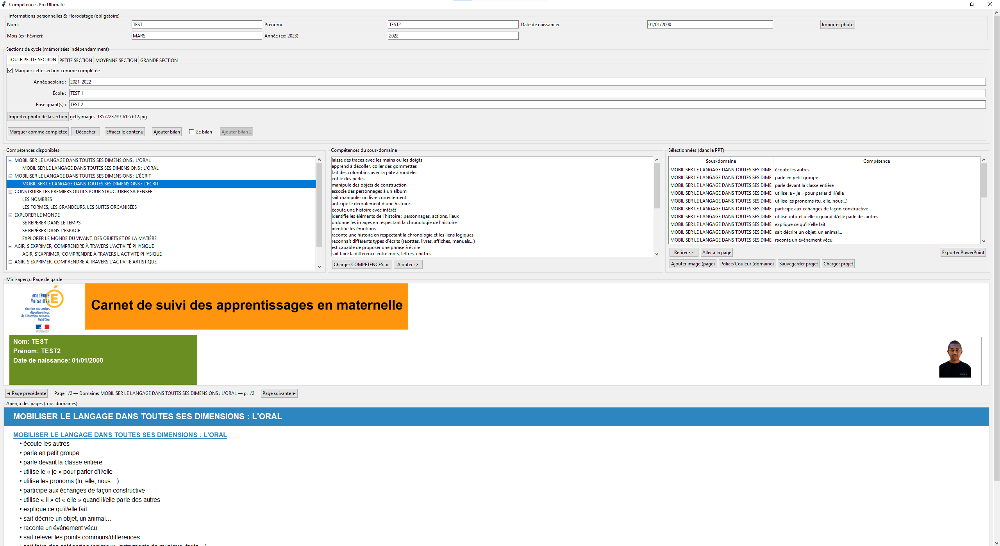
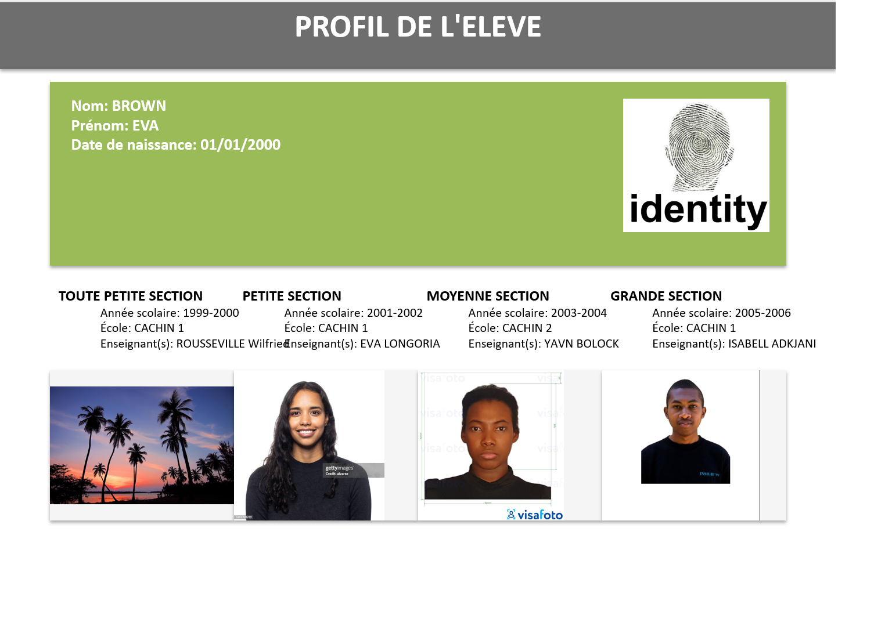
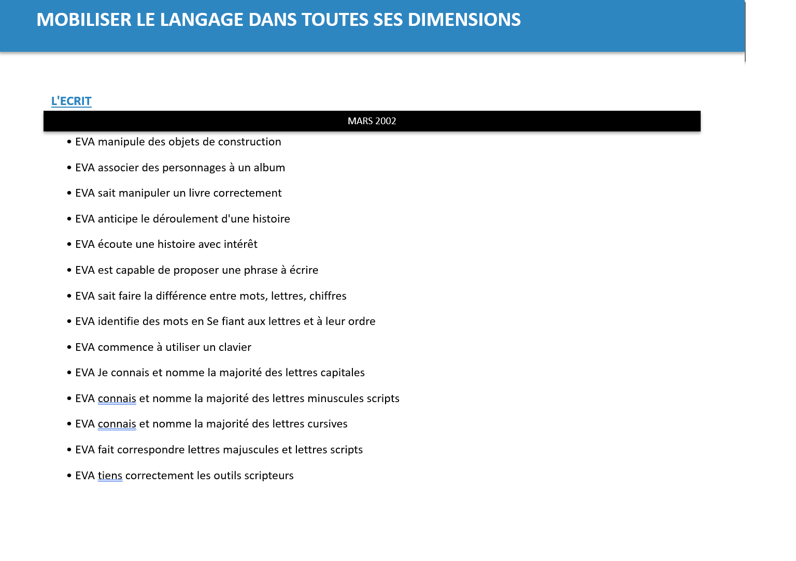

# Livret Numérique des Compétences







Ce projet est un script avec interface graphique permettant de générer automatiquement un livret numérique des compétences pour chaque élève, sous la forme d’un fichier PowerPoint personnalisé.

## Fonctionnalités principales

- Importation d’une liste de compétences à partir d’un fichier .txt structuré (domaines et sous-domaines).
- Génération automatique d’un PowerPoint contenant :
  - La fiche de présentation de l’élève (nom, prénom, date de naissance).
  - Les informations sur les différentes sections fréquentées (Toute Petite Section, Petite Section, Moyenne Section, Grande Section), avec :
    - Année scolaire
    - École
    - Enseignant(s)
  - Les compétences acquises pour chaque domaine et sous-domaine durant l’année.
  - Ajout de la photo de l’élève et d’illustrations sur les pages.
  - Une page par domaine, avec mise en page automatique (auto-scaling des zones de texte et d’image).
- Interface utilisateur pour :
  - Prévisualiser les pages du livret
  - Sélectionner, ajouter ou supprimer des compétences
  - Gérer les photos à intégrer

## Public visé

- Enseignant(e)s de maternelle ou primaire
- Écoles souhaitant automatiser la création de livrets personnalisés pour chaque élève

## Installation & Utilisation

### Version Exécutable (Recommandé pour Windows)
1. Téléchargez la dernière version de `LivretCompetences.exe` depuis les [Releases](https://github.com/albatror/Livret-Numerique-Competences/releases) (ou générée via GitHub Actions).
2. Lancez l'exécutable directement. Aucune installation de Python ou de bibliothèques n'est requise.

### Version Développeur / Manuel
1. Installez Python 3.x et Git.
2. Clonez ce dépôt :
   ```bash
   git clone https://github.com/albatror/Livret-Numerique-Competences.git
   cd Livret-Numerique-Competences
   ```
3. Installez les dépendances :
   ```bash
   pip install -r requirements.txt
   ```
4. Lancez le script principal :
   ```bash
   python Interface.py
   ```

### Construction de l'exécutable
Si vous souhaitez construire vous-même l'exécutable sous Windows :
- Double-cliquez sur `build_windows.bat` (nécessite Python installé).
- L'exécutable sera généré dans le dossier `dist/`.

## Utilisation de l'application
1. Placez votre fichier `COMPETENCES.txt` (et éventuellement `DOMAINES.txt` et `COULEURS_DOMAINES.txt`) dans le même répertoire que l'application (ou ils seront chargés par défaut s'ils sont inclus dans le pack).
2. Suivez l’interface pour saisir les informations de l’élève, choisir les compétences et générer le livret PowerPoint.

## Dépendances

- Python 3.x
- Bibliothèques utilisées :
    - pillow
    - python-pptx

## Exemple de fichier de compétences

```
Domaine 1
  Sous-domaine 1.1
  Sous-domaine 1.2
Domaine 2
  Sous-domaine 2.1
...
```

## Licence

Projet open source sous licence MIT.
